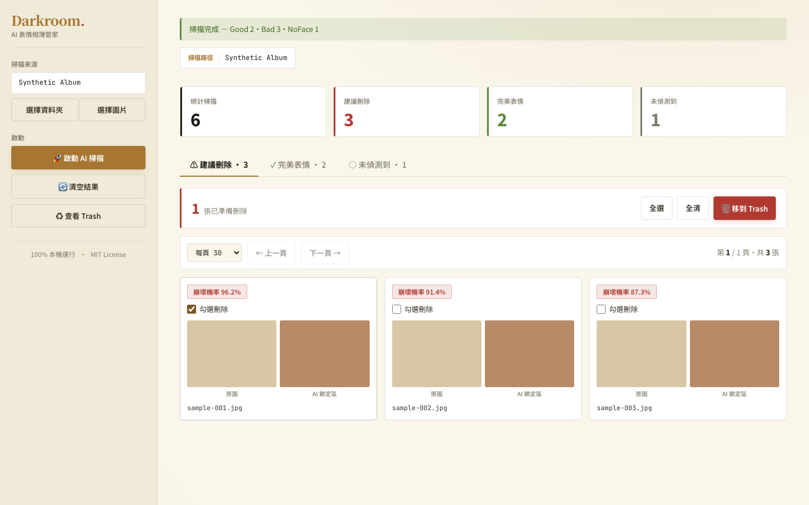

# AI 表情相簿管家 — Smart Album Cleaner

Smart Album Cleaner 是在本機執行的照片整理工具。它使用 MobileNetV3 模型分析人臉表情品質，讓使用者檢視掃描結果，並以可還原的 Trash 流程整理照片。

目前唯一的應用程式架構是 **FastAPI + Vue 3**：`backend/main.py` 提供 REST API 並服務建置後的前端，`frontend/` 是 Vue 3 SPA。專案不再提供另一套 Web UI 入口。

App version `0.2.0` and classifier release `v1.0.0` are independent release
identifiers: the app version describes this source tree, while the classifier
tag identifies the separately downloaded checkpoint artifact.

**Evidence summary (English):** The tracked evaluation reports **75.1% accuracy on 193 labelled test examples** for the subjective binary `Good`/`Bad` task (`Bad` recall 82.8%; `Good` recall 67.0%). This result does not establish real-world, subgroup, or identity-recognition performance. Performance depends on hardware and image size; no reproducible runtime benchmark is tracked. See the [Model Card](docs/MODEL_CARD.md) for evidence, class-level results, and limitations.

## Synthetic UI evidence



This portfolio screenshot is generated entirely from synthetic fixtures and
contains no real or private photos.

## 功能範圍

- 選擇本機照片資料夾或檔案後啟動掃描工作。
- 在 Vue 介面輪詢掃描進度並檢視分類結果。
- 透過 Trash 清單執行軟刪除、還原或移至系統垃圾桶。
- 由 FastAPI 限制可存取的 Host、Origin 與已授權照片根目錄。
- 使用 `weights_only=True` 載入 PyTorch checkpoint。

## 安裝與啟動

需求：Python 3.11+、Node.js 20.19+ 或 22.12+，以及 Git。

### macOS / Linux

```bash
git clone https://github.com/Hunter20041004/smart-album-cleaner.git
cd smart-album-cleaner

set -euo pipefail
MODEL_URL=https://github.com/Hunter20041004/smart-album-cleaner/releases/download/v1.0.0/mobilenet_face.pth
MODEL_SHA256=b7dd3b7d95c13c07167d269d65f49367d0b0007fcf0dc272ab1f94c34f3f4bf0
MODEL_TMP="$(mktemp)"
trap 'rm -f "$MODEL_TMP"' EXIT
curl --fail --location --show-error "$MODEL_URL" -o "$MODEL_TMP"
printf '%s  %s\n' "$MODEL_SHA256" "$MODEL_TMP" | shasum -a 256 -c -
mkdir -p models
mv "$MODEL_TMP" models/mobilenet_face.pth
trap - EXIT

./run.sh
```

`run.sh` 會建立 `.venv`、安裝 Python 依賴、下載並驗證 MediaPipe 模型，並在 Vue 原始碼或 package lock 的 fingerprint 改變時重建前端，最後以 Uvicorn 啟動 `backend.main:app`。fingerprint 相符時可直接使用既有離線 build；需要強制重建時執行 `FORCE_FRONTEND_BUILD=1 ./run.sh`。瀏覽器開啟 <http://localhost:8000>。

### Windows（僅開發啟動）

> 平台限制：原生資料夾／檔案選擇器與完整 UI 掃描流程目前僅支援 macOS。下列 Windows 指令僅供前後端開發啟動；目前 Windows UI 無法選取掃描來源，也不支援完整掃描流程。

```bat
git clone https://github.com/Hunter20041004/smart-album-cleaner.git
cd smart-album-cleaner

set "MODEL_URL=https://github.com/Hunter20041004/smart-album-cleaner/releases/download/v1.0.0/mobilenet_face.pth"
set "MODEL_SHA256=b7dd3b7d95c13c07167d269d65f49367d0b0007fcf0dc272ab1f94c34f3f4bf0"
set "MODEL_TMP=%TEMP%\mobilenet_face-%RANDOM%.pth"
curl -fL "%MODEL_URL%" -o "%MODEL_TMP%"
if errorlevel 1 (
  del /q "%MODEL_TMP%" 2>nul
  exit /b 1
)
powershell -NoProfile -Command "try { $actual=(Get-FileHash -LiteralPath $env:MODEL_TMP -Algorithm SHA256).Hash.ToLower(); if ($actual -ne $env:MODEL_SHA256) { throw 'classifier checksum mismatch' }; New-Item -ItemType Directory -Force -Path models | Out-Null; Move-Item -LiteralPath $env:MODEL_TMP -Destination models/mobilenet_face.pth -Force } finally { Remove-Item -LiteralPath $env:MODEL_TMP -Force -ErrorAction SilentlyContinue }"
if errorlevel 1 exit /b 1

python -m venv .venv
.venv\Scripts\pip install -r requirements.txt
.venv\Scripts\python scripts\download_models.py

cd frontend
npm install
npm run build
cd ..

.venv\Scripts\uvicorn backend.main:app --host 127.0.0.1 --port 8000
```

## 開發模式

後端：

```bash
.venv/bin/uvicorn backend.main:app --host 127.0.0.1 --port 8000 --reload
```

前端：

```bash
cd frontend
npm install
npm run dev
```

Vite 開發伺服器由 `frontend/vite.config.js` 將 API 請求轉送至本機 FastAPI。

## 技術架構

```text
Vue 3 SPA (frontend/)
        │ REST API
        ▼
FastAPI (backend/main.py)
        │
        ├── src/face_detector.py      MediaPipe 人臉偵測
        ├── src/predict_face.py       MobileNetV3 推論
        └── 本機照片與 Trash          授權根目錄內操作
```

Production build 由 FastAPI 同源服務；開發時則由 Vite 提供前端 hot reload。

## 專案結構

```text
backend/main.py             FastAPI 應用程式與 REST API
frontend/                   Vue 3 + Vite 前端
src/                        資料準備、訓練、推論與評估
scripts/download_models.py  MediaPipe 模型下載與雜湊驗證
tests/                      Python 測試與公開作品集契約
run.sh                      macOS / Linux 本機啟動腳本
```

## 自訓模型

資料準備、訓練與評估仍由 `src/` 下的命令列工具負責。macOS / Linux 在 `./run.sh` 建立 `.venv` 後執行：

```bash
.venv/bin/python -m src.prepare_dataset
.venv/bin/python -m src.train_mobilenet --arch mobilenet_v3_large
.venv/bin/python -m src.train_mobilenet --arch mobilenet_v3_large --finetune
.venv/bin/python -m src.evaluate --model models/mobilenet_face.pth
```

訓練照片、處理後資料、Trash、快取與模型權重都應保留在本機，且不提交到 Git。

## 驗證

```bash
.venv/bin/python -m pip install -r requirements-dev.txt
.venv/bin/python -m pytest -q
.venv/bin/python -m ruff check .
cd frontend && npm install && npm run build
```

## License

The [`LICENSE`](LICENSE) file is intentionally narrow: **MIT applies only to
project-owned source code** in this repository. The repository does not grant
blanket MIT rights over models, data, evaluation material, dependencies, or
user content.

- **Classifier checkpoint licence: unknown.** The tracked evidence verifies a
  release checksum, not redistribution or reuse rights for
  `mobilenet_face.pth`.
- **Dataset and evaluation artifact licences: unknown.** Their tracked
  provenance does not establish origin, consent, or reuse terms, so they must
  not be treated as MIT-licensed.
- **MediaPipe model and third-party dependencies retain their own licences**
  and terms; consult their upstream distributions before reuse.
- **User images are not covered by the project licence.** They remain local
  user content and are not included in this repository.
- [`docs/screenshots/dashboard.png`](docs/screenshots/dashboard.png) is a
  synthetic, project-generated UI capture containing no real or private
  photos.
